# Project write-up

## Research question

Pooling medical images from many patients into one training set assumes that the
images are comparable. Using the UPENN-GBM collection (Bakas et al. 2021), it was
asked what the DICOM headers of a glioblastoma cohort reveal about the equipment,
the pixel grid, the encoding and the de-identification. It was then asked how
well a small convolutional network separates tumor from healthy tissue on
patients it has never seen. The first question bounds what the second is allowed
to claim.

## Acquisition

The full collection holds 630 patients and 3,680 MR series, acquired on 17
manufacturer and model combinations across 3 manufacturers. A rule selects the
subset. A patient is eligible when a post-contrast T1 series of that patient
carries a segmentation in which at least one segment is marked as reviewed by a
person. Eligible patients are sorted by identifier and capped at 50, with the cap
filled from each scanner model in turn so that capping cannot drop the models
that contribute fewest patients. The rule returns 49 eligible patients, from
`UPENN-GBM-00019` to `UPENN-GBM-00626`, holding 273 image series and 49
segmentation series, 59,762 files and 9.44 GB on disk. Running the rule again
against index release 24.2.2 returns the same patients, and the reproducibility
gate checks that `data/manifest.csv` comes back byte for byte identical.

The post-contrast T1 series is identified by markers in the series description. A
description qualifies when it carries both a T1 marker and a post-contrast marker
and carries neither a T2 nor a FLAIR marker. The rule is emitted as SQL for the
index and mirrored by a Python predicate the gates use, so the two cannot drift.

That rule replaces a literal protocol string, and the replacement is the reason
every number in this write-up changed. The previous version of this analysis
selected the labeled series by matching one manufacturer's protocol name, and it
reported the resulting single-scanner cohort as an unintended consequence of
asking for radiologist-corrected segmentations. That attribution was wrong. The
segmentation filter preserves heterogeneity and the protocol string destroyed it.
The marker rule admits 8 distinct descriptions, listed in
`results/label_series_descriptions.csv`. Three of them begin with the string the
old rule matched and account for 41 of the 49 patients, all on one scanner model,
and the other five descriptions carry the remaining 8 patients across the other
five models. A selection rule keyed on one vendor's protocol vocabulary silently
produced a cohort that could not support the claim the quality-control half was
built to make. The defect stayed invisible until the rule was decomposed and each
filter was run on its own against the index.

Images and labels are pulled from the NCI Imaging Data Commons object store
(Fedorov et al. 2021), which needs no credentials. Each downloaded series is
digested, and the digest is compared against `data/checksums.txt` on every run.
The acquisition gate also asks the data commons index and the archive that
published the images what license they report for these series today; both must
answer CC BY 4.0 before anything proceeds.

The labels are the BAMF annotations (Van Oss et al. 2024) and not the
segmentations the collection's own authors published. The authors' NIfTI volumes
sit on a co-registered grid that does not align with the DICOM images, and the
archive serves them only through a transfer client. The BAMF annotations are
DICOM Segmentation objects that name the image series they were drawn on, which
makes the correspondence checkable.

## Cohort quality control

Every one of the 59,713 image instances was read and seventeen header tags were
extracted by group and element number. Addressing tags by number and not by
keyword means that a renamed keyword in a future release of the reading library
cannot silently change what is read. The schema gate re-reads a random sample of
forty files and confirms that the recorded table reproduces what the files
contain.

The cohort holds 6 manufacturer and model combinations across 2 manufacturers,
out of the 17 combinations and 3 manufacturers the whole collection carries. The
distribution is lopsided: the largest model holds 87.5 percent of the 273 series,
and the labeled series of only 7 patients was acquired on one of the other five
models. One patient contributed series from two models and the other 48 each sit
on one, so the counts by all series and the counts by labeled series differ by
one patient. The modeling
half can therefore say something about variation across equipment, and it cannot
claim a balanced comparison.

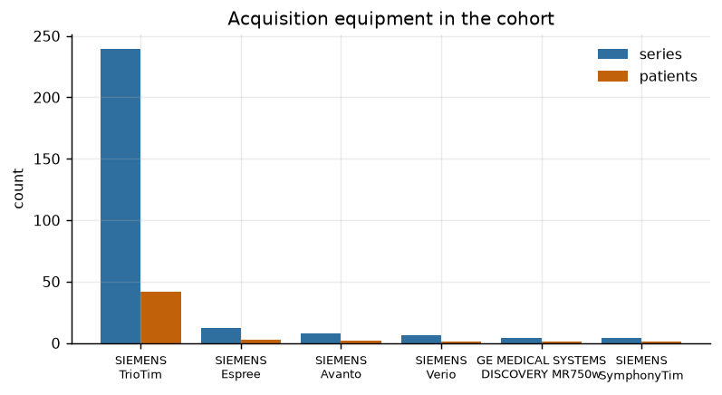

The studies also hold acquisitions that are not structural. Fifteen distinct
descriptions covering 77 of the 273 series are diffusion or perfusion sequences,
whose contrast is unrelated to the contrast the segmentation was drawn on. They
are counted here and excluded from the labeled task, leaving 196 structural
series. The markers that drive this classification cover the T1, T2 and FLAIR
naming of every model in the cohort. A marker list tied to one vendor's protocol
names would file another vendor's structural series as a diffusion or perfusion
acquisition, which is the same failure the cohort rule carried.

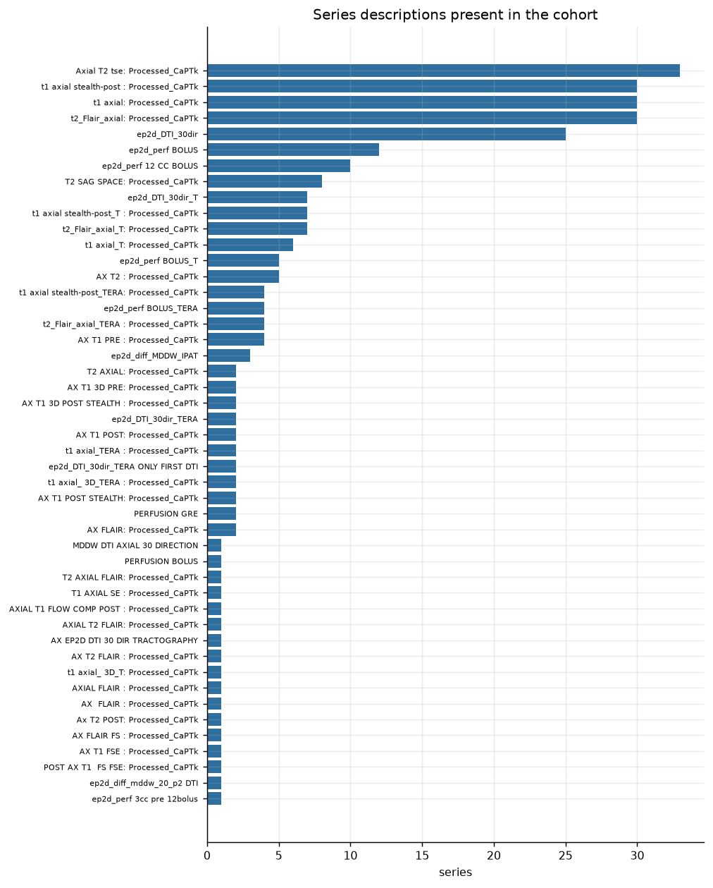

Geometry is heterogeneous within patients as well as across them. Twelve distinct
row and column combinations appear, 48 of the 49 patients hold more than one, and
one patient holds four. Comparing the first and the last series each patient
contributed, 34 of 49 change image size between them.

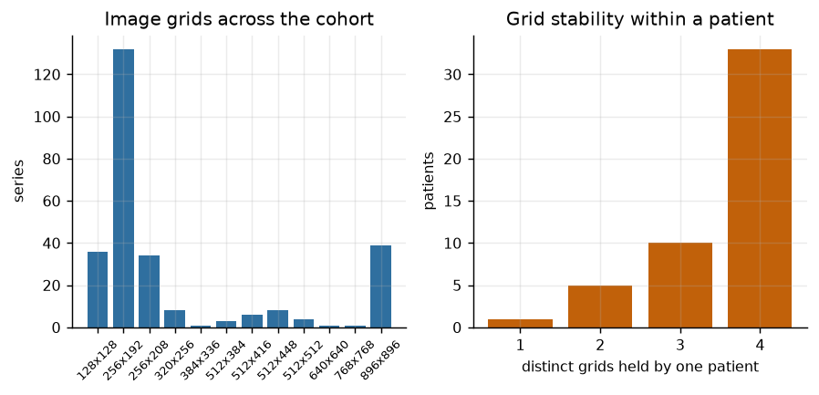

Encoding is uniform: all 273 series are MR, all are MONOCHROME2, and all allocate
16 bits per pixel. Checking each tag for constancy within its series found no
series carrying two values of rows, columns, photometric interpretation, bit
depth, manufacturer or model, so a series is a safe unit of description. The
complete record is `results/qc_findings.csv`, which holds 149 findings, 114 of
them flagged.

## Image geometry across manufacturers

Re-cutting the cohort across manufacturers exposed a defect in the orientation
comparison and a defect in the image and segmentation alignment. Each stopped the
pipeline before it was measured. Both are results of the quality-control half and
not incidental notes.

**Orientation.** Assembling a series into a volume compares the
`ImageOrientationPatient` of every slice, and with no tolerance supplied that
comparison is an equality test on the stored decimal text. All 59,713 instances
carry the tag. Of the 273 series, 3 carry more than one distinct value, and all
three belong to the single patient on the one non-Siemens model. The worst of
them carries 5 distinct values across 35 slices, differing in the seventh decimal
place. The largest genuine angular disagreement in the cohort is 7.772e-15 in
cosine similarity, which displaces about 31 nanometers across the widest field of
view, so no slice in this cohort was acquired at a different angle from its
neighbors. Volume assembly is given an orientation tolerance of 1e-05, the
deviation is measured per series and recorded, and the gate fails if the measured
deviation does not clear the tolerance by a stated margin. The tolerance protects
the volume assembly and the recorded finding protects the claim.

**Alignment.** Placing a segmentation on the geometry of its image series
requires the translation between the two origins to fall on a whole number of
voxels. Of the 49 image and segmentation pairs, 5 leave a residual above the
1e-05 library default, and the cohort median is 5.744e-06 voxels. The largest
residual is 1.7359e-03 voxels on `UPENN-GBM-00452`, which displaces the mask
8.1379e-04 mm. All five sit on scanner models the previous single-scanner cohort
did not contain. The 44 pairs on the two models that produced none, holding 42
and 2 patients, sit below the default.

Each residual was traced to the decimal string that produces it, so the
classification is a measurement and not a judgment. One segmentation writes its
pixel spacing as `4.882812e-01` against the image's `0.48828125`. Another writes
slice spacing as `4.999992e+00` against the 5.000008 mm the image describes, and
that pair's measured spacing ratio residual is 3.1806e-06, the largest in the
cohort. The worst patient writes its image position to six significant figures,
so a coordinate near 200 mm is quantized at 1e-03 mm.

That quantum sets the line. Three coordinates each rounded to within 5e-04 mm can
misplace an origin along a direction by at most 8.66e-04 mm, and the largest
displacement the cohort holds is 8.138e-04 mm, inside that bound. A displacement
outside the bound would be a position the label and the image genuinely disagree
on, and admitting one would move the mask off the tissue it describes. Nothing in
the cohort crossed the line. The translation tolerance is 2e-02 voxels, and the
direction and spacing comparisons are held separately to 1e-04 so that loosening
the translation does not loosen them.

The orientation finding and the alignment finding are the case for running
quality control on a heterogeneous cohort. A pipeline built and tested on one manufacturer's output carried two latent
failures, and neither was reachable from the data that pipeline had seen.

## De-identification

The audit read one instance from each of the 322 series, and not every instance.
No series carries a populated birth date, address, telephone number, institution
address, or referring, performing or operating physician name. Every patient
identifier follows the collection form and the patient name repeats it. No series
declares burned-in annotation; that result is a declaration read from tag
(0028,0301) and not an inspection of pixel data, and the tag carries no value in
any of the 322 series.

The audit leaves two gaps. The 273 image series declare that patient identity
was removed and the 49 segmentation series carry no value for that tag at all,
which is why 322 audited series yield 273 declarations. A separate process
generated the segmentations later. All 273 image series carry private vendor
tags, up to 43 in one series, whose contents lie outside the standard dictionary
and were not inspected.

## Label provenance

The labels are automated segmentations of which some segments were reviewed and
corrected by a radiologist. The cohort filter requires that a segmentation series
carry at least one reviewed segment, which is a property of the series and not of
every segment in it. Stage 4 reads the algorithm type of each tumor segment
separately and attributes positive voxels over the union, so overlapping segments
are not double counted.

Across the cohort 3,022,788 of 3,993,796 tumor voxels come from a reviewed
segment, a share of 0.7569, leaving 0.2431 unreviewed. Per patient the reviewed
share runs from 0.2089 to 0.9998 with a median of 0.7598. No patient is fully
reviewed and all 49 carry unreviewed voxels, with 98 reviewed segments against 49
unreviewed.

The unreviewed quarter is not scattered through the label. The unreviewed voxel
count of 971,008 equals the enhancing-lesion segment count exactly, and there are
exactly 49 unreviewed segments, one per patient. The enhancing-lesion segment is
the unreviewed one throughout, and it never overlaps a reviewed segment. Every
positive patch drawn from enhancing lesion alone therefore rests on an
unreviewed contour, and the labels cannot be described as radiologist-corrected
without that qualification.

## Feature engineering

Each patient's post-contrast T1 volume is paired with its segmentation. The
segmentation is stored on its own grid, so the two arrays cannot be overlaid
directly. Its direction vectors are collinear with the image's to within
1.9984e-15 of a dot product of plus or minus one, and that measurement does not
record which of the two signs a matched pair takes. The mask is resampled onto
the image geometry through the patient coordinate system, under the tolerances
measured above, and the result is checked by eye and by the gate.

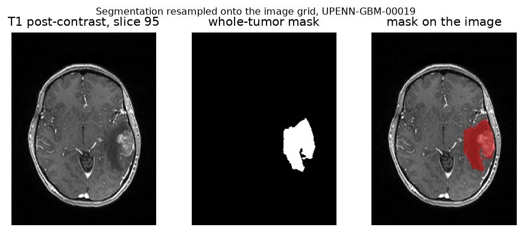

Tissue is separated from air by Otsu's threshold on each volume, which needs no
tuned constant. Testing for a non-zero voxel would count the
reconstruction noise that fills the air compartment as tissue, and negative
patches cut from air would let the network separate tissue from air in place of
tumor from tissue. Under Otsu's threshold the share of near-empty negatives is 0,
and mean patch intensity is 0.3003 for negatives against 0.3251 for positives, so
brightness alone does not separate the classes. Tissue occupies a median 25.3
percent of a volume. A preparation gate fails if more than 1 percent of negative
patches are near-empty.

Patches of 32 by 32 pixels are cut on an eight pixel stride. A patch is positive
when at least half its pixels lie inside the union of the necrosis, edema and
enhancing-lesion segments, and negative when none do and at least half its pixels
are tissue. Patches between the two are ambiguous, and 197,060 of them were
discarded.

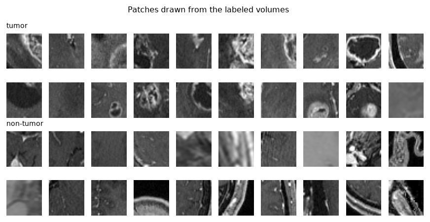

Tumor occupies a median 2.55 percent of the tissue volume, so a grid sweep is
overwhelmingly negative: the median patient yields a natural positive rate of
0.0186 before any sampling. Training on that distribution at a fixed threshold
would be uninformative, so negatives are subsampled to twice the positives for
each patient, and positives are capped at 500 per patient. The result is 58,788
patches at a positive rate of 0.3333, between 87 and 1,500 per patient. That
prevalence is a design choice and not a property of the anatomy, and both rates
are recorded.

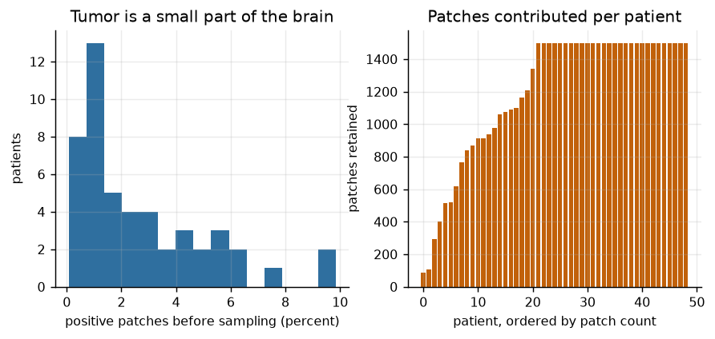

## Splitting

Patches cut on an eight pixel stride overlap their neighbors by three quarters of
their area, so two patches from one patient are near duplicates. Whole patients
are therefore assigned to one part of the split: 29 to training, 7 to validation
and 13 to test, giving 38,070, 6,306 and 14,412 patches. Each part carries the
same 0.3333 positive rate. No patient appears in more than one part, and the
modeling gate checks it.

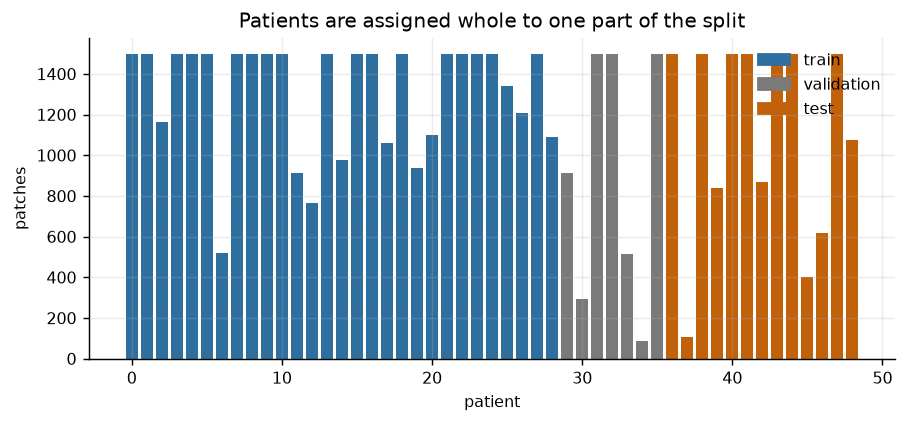

## Modeling

The architecture is the one the coursework specified. Convolutional blocks of 16,
16 and 64 filters carry batch normalization on the second and third and max
pooling after each, followed by a 64 unit dense layer, dropout, and a single
sigmoid output. It holds 77,585 parameters.

The original compiled this model with an Adadelta learning rate of zero. A
learning rate scheduler callback then assigned 0.01 at the start of every epoch,
so the network trained at a rate the compile call never set, and the declared
configuration and the effective one disagreed. Here the optimizer is given a real
learning rate at construction, and that rate is chosen by the grid search the
exercise was named after but never ran. Four combinations of learning rate and
dropout were trained for 8 epochs and scored on 7 validation patients and 6,306
validation patches. Those patients appear in neither the training nor the test
set.

| Learning rate | Dropout | Validation ROC-AUC, best epoch | Validation ROC-AUC, final epoch | Epoch kept |
|---:|---:|---:|---:|---:|
| 1.0 | 0.5 | 0.9543 | 0.9524 | 7 |
| 1.0 | 0.3 | 0.9535 | 0.9300 | 7 |
| 0.1 | 0.3 | 0.9324 | 0.9128 | 7 |
| 0.1 | 0.5 | 0.9208 | 0.8934 | 7 |

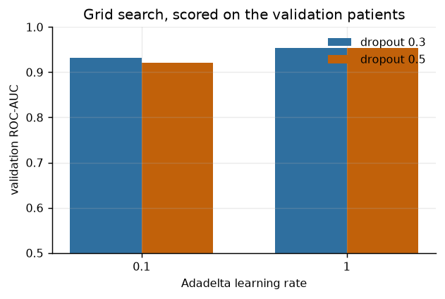

The selection criterion is the best-epoch validation ROC-AUC, recorded as a
metric so the choice is auditable. The alternative criterion, the score at the
final epoch, agrees with it: both select a learning rate of 1.0 with dropout 0.5.
The spread of 0.0335 between the best and the worst combination on the selection
criterion is large enough that the choice matters. All four grid points kept
epoch 7 of 8, so the ranking does not turn on which epoch each run reached. That
combination was carried into a twenty epoch run.

### Restoring the epoch selection the rebuild had dropped

The coursework saved the weights of the epoch that scored best on the validation
set and reported that model. The rebuild had dropped the step and reported the
final epoch, which is a departure from the work it reconstructs and was not
deliberate. Best-epoch selection is now restored and applied uniformly to the
four grid points and to all six seed-variance runs.

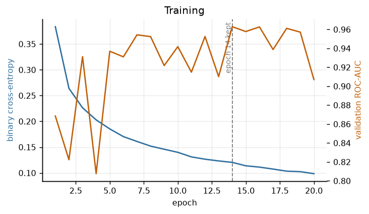

Validation ROC-AUC does not improve monotonically over the twenty epochs. It
falls as low as 0.8076 at epoch 4, reaches 0.9629 at epoch 14 and finishes at
0.9071, while training loss falls steadily to 0.0985. The reported model holds
the weights of epoch 14, and the vertical line in the figure marks it. Reporting
epoch 20 meant reporting one of the weakest validation scores in the second half
of the run.

What the omission cost is measured across every run and not asserted from one.
Each of the six seed-variance runs is scored at both candidate epochs, the final
and the retained. At the primary seed the final epoch scores 0.9723 on the test
patients against 0.9864 for the retained epoch, a gain of 0.0141.

| Seed | Partition | Final epoch | Retained epoch | Epoch kept | Gain |
|---|---|---:|---:|---:|---:|
| 20251117 | patient | 0.9723 | 0.9864 | 14 | 0.0141 |
| 20251117 | patch | 0.9888 | 0.9907 | 16 | 0.0019 |
| 20251118 | patient | 0.9202 | 0.9479 | 13 | 0.0277 |
| 20251118 | patch | 0.9658 | 0.9883 | 18 | 0.0225 |
| 20251119 | patient | 0.9151 | 0.9151 | 20 | 0.0000 |
| 20251119 | patch | 0.9663 | 0.9925 | 18 | 0.0262 |

The gain averages 0.0154 over the six runs and ranges from 0.0000 to 0.0277. The
primary seed's 0.0141 sits near that mean and is not the largest of the six, so
quoting it beside the headline score does not flatter the change. Under the
patient-level partition the gain averages 0.0139 and under the patch-level
partition 0.0169, so it is of similar size on both and does not account for the
difference between them.

Selection does not always help. One run of the six kept its final epoch and
gained nothing: seed 20251119 on the patient-level partition, whose best
validation epoch is epoch 20. The mean is an average over runs that includes that
zero, and it is not a guarantee that any given run improves.

The monitored quantity is validation ROC-AUC and not validation loss, because
ROC-AUC is what this repository reports, gates and runs its leakage comparison
on. Validation loss is measured at every epoch alongside it, and the two monitors
disagree. Loss is lowest at epoch 7, whose validation ROC-AUC is 0.9543, and the
loss at the retained epoch 14 is 0.2798 against 0.2709 at epoch 7. Validation
loss swings between 0.2709 and 1.5563 over the twenty epochs while validation
ROC-AUC stays between 0.8076 and 0.9629. The disagreement between the two
monitors is itself a recorded metric.

The retained epoch is chosen on the same 7 validation patients that chose the
learning rate and the dropout. Every quantity read from that set has been
maximized over, so none of them estimates performance.

## Evaluation

On the 13 held-out patients the network reaches a ROC-AUC of 0.9864 and an
accuracy of 0.9519, against 0.6667 for always predicting the majority class. Both
of those figures are read at the constructed positive rate set out below and not
at the rate a whole-brain sweep produces. The test patients take no part in
choosing the split, the hyperparameters or the retained epoch, so the ROC-AUC is
unbiased.

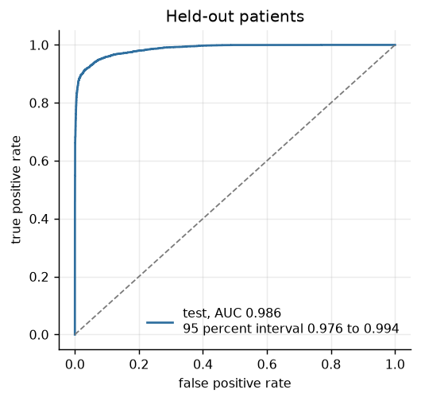

That score is the best of three seeds. The same pipeline at seeds 20251118 and
20251119 scores 0.9479 and 0.9151, for a mean of 0.9498 across the three. The
primary seed was fixed before any of these runs and was not selected for its
result, and the headline number is quoted at it so that it stays traceable to one
run. A patient-level bootstrap over the test patients, 2,000 resamples at the 95
percent level, gives an interval of 0.9763 to 0.9941 with a median of 0.9870.
That interval covers neither of the other two seeds. It measures uncertainty from
the sample of patients alone and understates the total uncertainty, and the seed
range of 0.9151 to 0.9864 is the more honest summary of what a 49-patient cohort
supports.

Validation ROC-AUC is 0.9629 and validation accuracy is 0.8957, and neither is a
performance estimate. Both are read at the epoch that was kept for having the
highest validation ROC-AUC, so 0.9629 is the maximum of twenty scores on the set
that maximum was taken over. Comparing it with the test score measures nothing
about generalization, and it is reported only to make the selection auditable.

At a threshold of 0.5 the errors are uneven: 158 false positives against 535
false negatives. Tumor precision is 0.9643 and tumor recall is 0.8886, so 11.1
percent of the tumor patches are missed and 1.6 percent of the healthy ones are
called tumor.

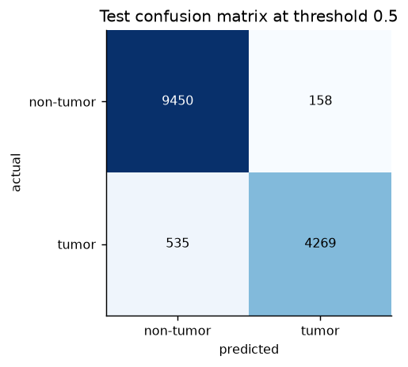

Those precision figures are read at the constructed positive rate of 0.3333, and
so are the accuracies above and the 0.6667 majority baseline, which restates the
constructed prevalence. At the natural rate of 0.0186 the majority baseline would
be 0.9814, and the same ranking would give far lower precision at a fixed
threshold. The operating point reported here does not transfer to a whole-brain
sweep.

The imbalance belongs to the threshold and not to the ranking. An area under the
curve of 0.9864 says the scores separate the classes well, and 0.5 does not sit
at the point that balances the two error types. The direction is not fixed: on
the training patches the same threshold gives 1,136 false positives against 340
false negatives, which is the opposite imbalance. Moving the threshold down would
recover recall at the cost of precision, and a screening use would want that
trade.

Training ROC-AUC of 0.9962 against 0.9864 on held-out patients is a small gap, so
the network is not memorizing its training patients as heavily as the
architecture would allow. Pooling patches hides variation between patients:
across the 13 test patients the median ROC-AUC is 0.9942 and the range runs from
0.9565 to 1.000, with none below 0.8.

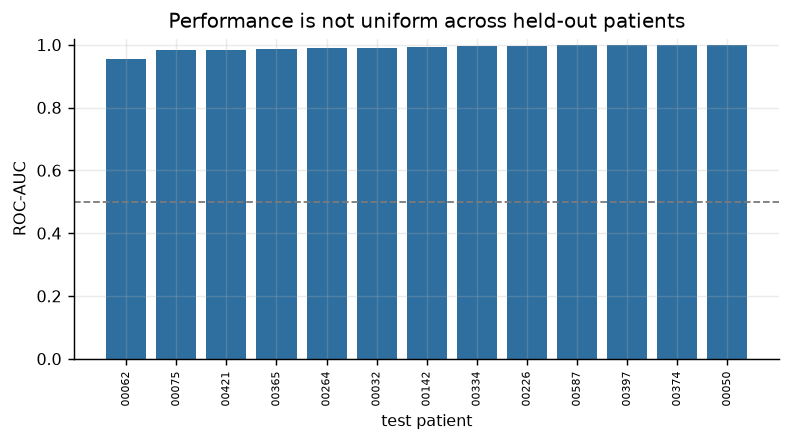

The sampled errors show no single appearance accounting for either kind. The
false positives mix flat parenchyma with patches crossing a bright vessel or a
tissue boundary. The false negatives mix flat low-contrast patches with patches
holding part of a bright enhancing rim.

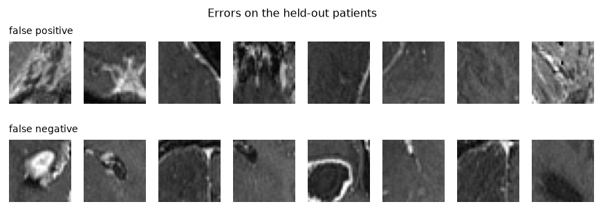

## What splitting over patches would have reported

Training the same architecture with the same hyperparameters on a partition that
shuffles patches raises the test ROC-AUC at every seed: 0.9864 to 0.9907 at the
primary seed, 0.9479 to 0.9883, and 0.9151 to 0.9925. All 49 patients then appear
on both sides of the boundary, and near copies of the same tissue are scored as
if they came from new patients.

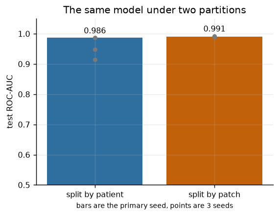

The inflation is 0.0043, 0.0404 and 0.0774 across the three seeds, a mean of
0.0407 over a spread of 0.0731, and positive on 3 of 3. The claim survives in
direction and not in magnitude, and the primary seed is the wrong place to read
it from. Its inflation of 0.0043 is the smallest of the three and an eighteenth
of the largest, so a single-seed report at that seed would understate the effect
by most of its size. The mean and the spread carry the claim.

The patch-level scores are far tighter across seeds than the patient-level ones,
0.9883 to 0.9925 against 0.9151 to 0.9864. That is the same defect seen a second
way. A partition holding near copies of one patient's tissue on both sides
suppresses the between-patient variation, so it returns a stable high score
whatever the seed, and the stability is an artifact and not a virtue. A reported
score of 0.9907 on this task would be an artifact of the partition.

## Limitations

The labels are not a clinical reference standard. An automated method produced
them and a radiologist reviewed part of them, and the unreviewed 0.2431 of the
positive voxels is the enhancing-lesion segment of every one of the 49 patients.
Agreement with an independent expert reading was not measured, so the ceiling on
any score here is unknown.

The cohort spans 6 scanner models and 87.5 percent of its series come from one of
them. Magnetic resonance intensity carries no absolute unit, and per-volume
normalization removes only the scale, so transfer to equipment outside these six
models was not tested and should not be assumed. The labeled series of only 7
patients was acquired on one of the other five models, which is too few to
compare performance across equipment.

The test set holds 13 patients, which is a small sample, and the reported score
is the best of three seeds. The seed range from 0.9151 to 0.9864 and the per-patient range from
0.9565 to 1.000 describe the spread better than the pooled figure does.

The cohort rule matches tokens in the series description, so it inherits a
dependence on naming convention. A post-contrast T1 acquisition whose description
carries no post-contrast token is not admitted. The rule accepts the 8
descriptions in `results/label_series_descriptions.csv` and rejects the remainder
of the vocabulary the collection uses, which shrinks the cohort and does not
corrupt it, because every admitted series is a post-contrast T1. It is the same
kind of dependence on vendor vocabulary that produced the single-scanner cohort,
held to a narrower scope. A rule keyed on acquisition parameters and not on
names would not carry it.

The learning rate, the dropout and the retained epoch were all chosen on the same
7 validation patients. Nothing read from that set estimates performance, and the
0.9629 it reports is the largest of twenty epoch scores taken over it. A
validation set of 7 patients, used twice, is a real weakness of a study this
size.

Patch classification is not tumor detection. Each patch is scored without spatial
context, and the 197,060 patches that straddled the tumor boundary were discarded
as ambiguous, which removes exactly the cases a segmentation model would have to
resolve.
